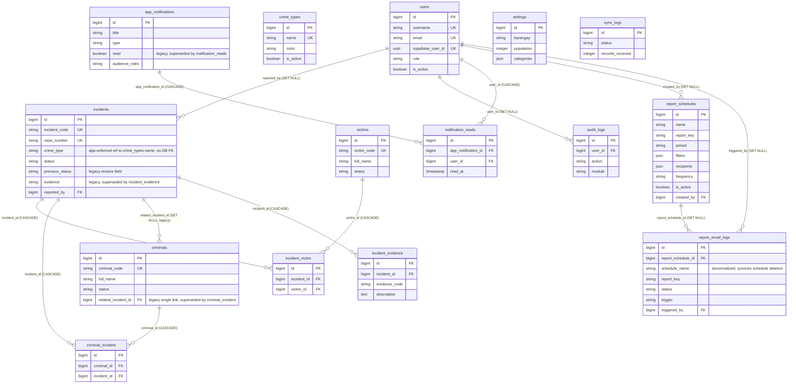

# Entity-Relationship Diagram

## 1. Purpose and Scope

This document is the Section 6.1 (Database Normalization) evidence artifact for
the BADAC Crime Data Analytics & Reporting System (CDARS) checklist. It shows
the **current, actual** database schema — not a proposed or idealized
redesign — as an entity-relationship diagram, so it can be read alongside
[`DATA_DICTIONARY.md`](./DATA_DICTIONARY.md), which documents the same schema
column-by-column.

**Format used:** [Mermaid](https://mermaid.js.org/syntax/entityRelationshipDiagram.html)
`erDiagram` syntax, rendered directly by GitHub and most Markdown viewers. No
new dependency or diagramming tool was added to the project to produce this;
Mermaid-in-Markdown was chosen because it is a plain-text, version-controlled
artifact that stays reviewable in a diff, and other project docs already use
fenced code blocks in the same way.

**Source of truth:** the diagram below was built entity-by-entity from the 29
migration files in `backend/database/migrations/` (the same source the data
dictionary is built from), cross-checked against the Eloquent model
relationship methods in `backend/app/Models/`. It reflects the schema as of
migration `2026_09_11_000001_create_report_schedules_and_report_email_logs_tables.php`,
the most recent migration in the repository at the time this diagram was
produced.

**How it was verified against the migrations:** every entity's primary key,
foreign key and unique-constraint markers below were checked one-to-one
against the corresponding `Schema::create()` / `Schema::table()` block; every
relationship line's cardinality and delete behavior were checked against the
`->constrained()->cascadeOnDelete()` / `->nullOnDelete()` call (or its
absence) on the owning column. No relationship is drawn that is not backed by
an actual foreign-key constraint in a migration — application-enforced links
that are **not** real database foreign keys are called out separately in
§4 rather than drawn as ER connectors, so the diagram does not overstate what
the database itself enforces.

---

## 2. Diagram

---

## 3. Tables Represented

All 15 current application/domain tables, matching the scope of
`DATA_DICTIONARY.md` §2:

`users`, `incidents`, `criminals`, `victims`, `criminal_incident`,
`incident_victim`, `incident_evidence`, `crime_types`, `audit_logs`,
`app_notifications`, `notification_reads`, `settings`, `sync_logs`,
`report_schedules`, `report_email_logs`.

**Framework tables excluded.** Laravel-managed tables (`cache`, `cache_locks`,
`jobs`, `failed_jobs`, `sessions`, `password_reset_tokens`) are intentionally
left off this diagram. None of them carries a foreign-key constraint into the
domain schema — `sessions.user_id` is indexed but explicitly **not**
FK-constrained (see `DATA_DICTIONARY.md` §4) — so including them would add
fifteen more disconnected boxes without showing any additional relationship.
They remain fully documented in the data dictionary.

---

## 4. Relationships Represented

### One-to-many (real foreign keys)

| Relationship | Delete Behavior |
|---|---|
| `incidents.reported_by` → `users.id` | `SET NULL` |
| `criminals.related_incident_id` → `incidents.id` (legacy) | `SET NULL` |
| `incident_evidence.incident_id` → `incidents.id` | `CASCADE` |
| `audit_logs.user_id` → `users.id` | `SET NULL` |
| `notification_reads.app_notification_id` → `app_notifications.id` | `CASCADE` |
| `notification_reads.user_id` → `users.id` | `CASCADE` |
| `report_schedules.created_by` → `users.id` | `SET NULL` |
| `report_email_logs.report_schedule_id` → `report_schedules.id` | `SET NULL` |
| `report_email_logs.triggered_by` → `users.id` | `SET NULL` |

### Many-to-many (via junction tables)

| Relationship | Junction | Delete Behavior |
|---|---|---|
| `incidents` ↔ `victims` | `incident_victim` | `CASCADE` on both sides |
| `incidents` ↔ `criminals` | `criminal_incident` | `CASCADE` on both sides |

### Application-enforced link — deliberately **not** drawn as a DB foreign key

- `incidents.crime_type` (string) is validated in application code against
  `crime_types.name` (`Rule::exists('crime_types', 'name')`), but there is no
  database foreign key from `incidents` to `crime_types`. This is the one
  place in the schema where the diagram intentionally omits a connector that
  a reader might otherwise expect, because drawing it would misrepresent what
  the database itself enforces.

### Coexisting legacy and current paths (both present, neither removed)

- `criminals` → `incidents`: the legacy single `related_incident_id` column
  and the `criminal_incident` many-to-many junction both exist and are both
  drawn above. `DATA_DICTIONARY.md` §3 documents the same duality.
- `app_notifications.read` is a legacy system-wide flag retained alongside
  the per-user `notification_reads` table; it is shown as a plain attribute
  on `app_notifications`, not a relationship, since it carries no foreign
  key.
- `incidents.evidence` is a legacy free-text field retained alongside the
  structured `incident_evidence` table.
- `report_email_logs` denormalizes `schedule_name` and `report_key` from
  `report_schedules` onto every row (rather than reading them back through
  the `report_schedule_id` relation) specifically so a log row remains
  meaningful after its originating schedule is deleted — which is also why
  that foreign key is `nullOnDelete` rather than `cascadeOnDelete`.

### Entities with no relationship connectors

`crime_types`, `settings` and `sync_logs` appear in the diagram as standalone
entities. `crime_types` is linked to `incidents` only through the
application-enforced name match described above; `settings` and `sync_logs`
carry no foreign keys in either direction in the current schema.

---

## 5. Normalization Finding vs. Evidence Availability

These are two separate claims and this document intentionally does not
conflate them:

- **Evidence artifact:** this diagram (Section 6.1's required evidence) now
  exists in the repository. Before this document, no ER diagram artifact was
  present.
- **Schema quality finding:** the domain schema is reasonably normalized —
  entities have single-purpose junction tables for their many-to-many
  relationships (`criminal_incident`, `incident_victim`), and repeating data
  is avoided except where a specific, documented reason overrides it
  (`report_email_logs`' denormalized `schedule_name`/`report_key`, kept so
  logs survive schedule deletion). It also carries several **known,
  intentional** transitional conditions that a strict normalization audit
  would flag: a legacy `criminals.related_incident_id` single-link column
  coexisting with the `criminal_incident` junction table, a legacy
  `incidents.evidence` text column coexisting with `incident_evidence`, a
  legacy `app_notifications.read` flag coexisting with `notification_reads`,
  and an application-enforced (not database-enforced) link from
  `incidents.crime_type` to `crime_types.name`. None of these were
  "corrected" by this diagram — per the Phase 1 scope, the diagram documents
  the schema as it actually is.

Producing this diagram is not, by itself, a claim that the schema has been
audited for full 3NF/BCNF compliance column-by-column; it is a structural
map of entities and relationships as they exist, verified against the
migrations as described in §1.

---

## 6. Source of Truth

Generated from the 29 migration files in `backend/database/migrations/` on
branch `feat/notifications-profile-mapping` at commit `3d11d5e`, cross-checked
against `backend/app/Models/`. As with `DATA_DICTIONARY.md`, the migrations
remain authoritative — where this diagram and the migration source disagree,
the migration source is correct and this diagram should be corrected.
